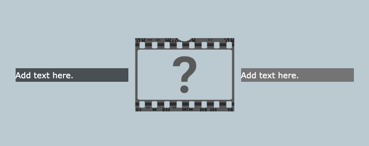
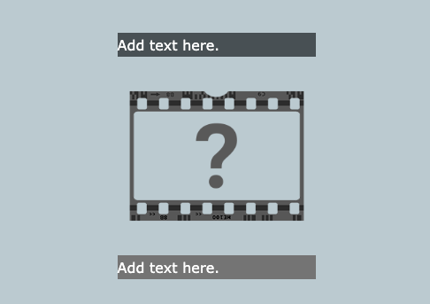

--- code ---
---
language: html
filename: index.html
line_numbers: false
---

<section class="wrap">
    

        
Add text here.

    

    
    

        
Add text here.

    

</section>

--- /code ---

Add or remove `
` and `` elements as needed. They will wrap if there is not enough space. 

Use the `primary`, `secondary` and `tertiary` styles to control the background and font colour for paragraphs of text.

