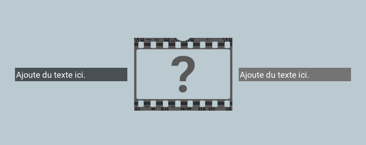
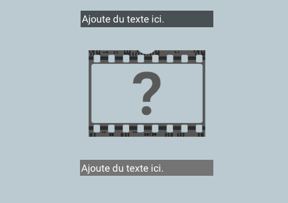

## --- code ---

language: html
filename: index.html
line_numbers: false
--------------------------------------------------------

<section class="wrap">
    

        
Ajoute du texte ici.

    

    
    

        
Ajoute du texte ici.

    

</section>

\--- /code ---

Ajoute ou supprime des éléments `
` et `` si nécessaire. Ils s'envelopperont s'il n'y a pas assez d'espace.

Utilise les styles `primaire`, `secondaire` et `tertiaire` pour contrôler l'arrière-plan et la couleur de la police pour les paragraphes de texte.

