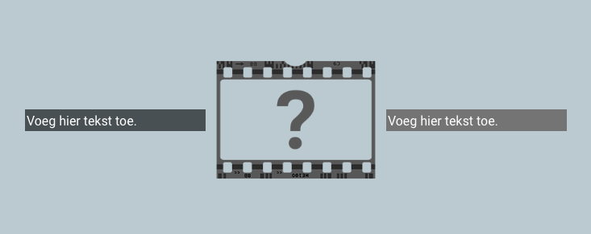
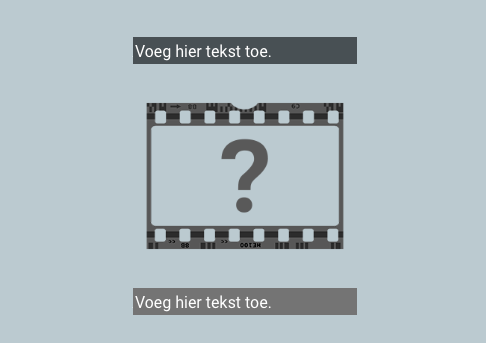

## --- code ---

language: html
filename: index.html
line_numbers: false
--------------------------------------------------------

<section class="wrap">
    

        
Voeg hier tekst toe.

    

    
    

        
Voeg hier tekst toe.

    

</section>

\--- /code ---

Voeg indien nodig `
` en `` elementen toe of verwijder deze. These elements will wrap if there is not enough space.

Gebruik de stijlen 'primair', 'secundair' en 'tertiair' om de achtergrond- en lettertypekleur voor de tekstparagrafen te bepalen.

