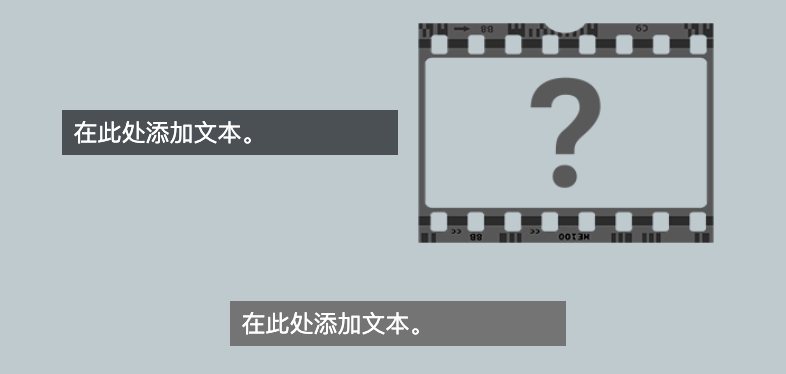
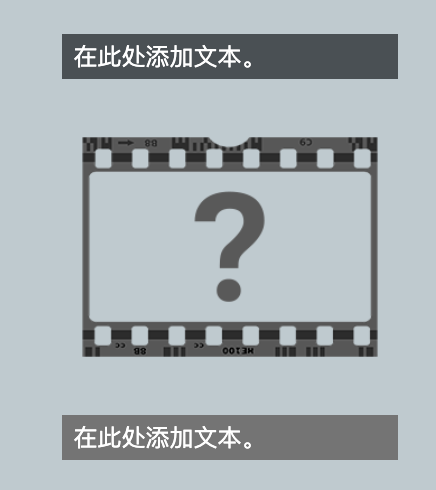

--- code ---
---
language: html
filename: index.html
line_numbers: false
---

<section class="wrap">
    

        
在此处添加文本。

    

    
    

        
在此处添加文本。

    

</section>

--- /code ---

根据需要添加或删除 `
` 和 `` 元素。 如果没有足够的空间，这些元素将会换行。

使用 `primary`，`secondary`，和 `tertiary` 样式来控制文本段落的背景和字体颜色。

